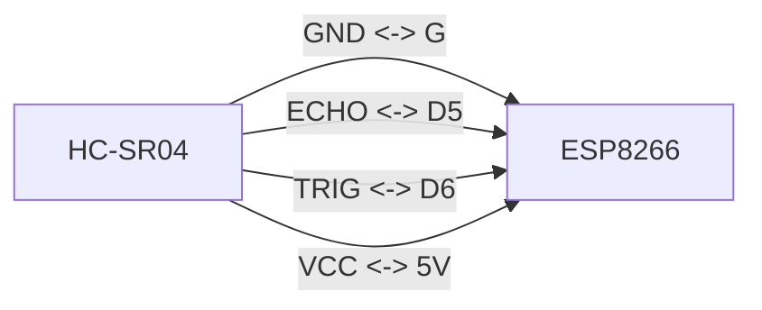
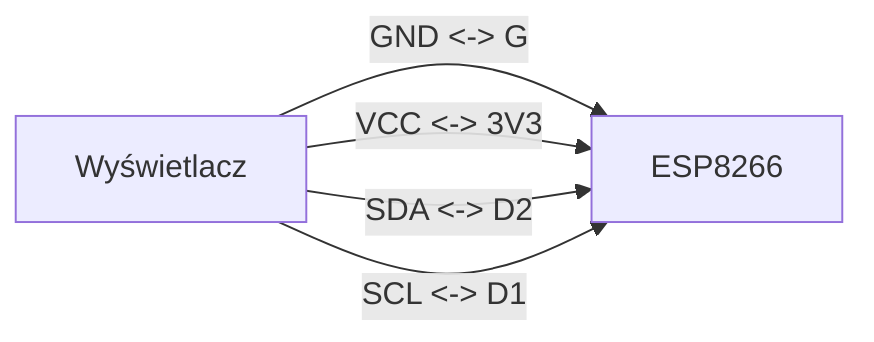
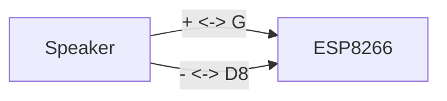
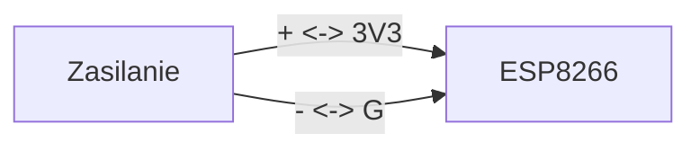

# smartBeerStand

# Schematy łączenia

## Połączenie HC-SR04 i ESP8266:

```mermaid
graph LR
A[HC-SR04] -- GND <-> G --> B[ESP8266]
A[HC-SR04] -- ECHO <-> D5 --> B[ESP8266]
A[HC-SR04] -- TRIG <-> D6 --> B[ESP8266]
A[HC-SR04] -- VCC <-> 5V --> B[ESP8266]
```

## Połączenie wyświetlacza i ESP8266:

```mermaid
graph LR
A[Wyświetlacz] -- GND <-> G --> B[ESP8266]
A[Wyświetlacz] -- VCC <-> 3V3 --> B[ESP8266]
A[Wyświetlacz] -- SDA <-> D2 --> B[ESP8266]
A[Wyświetlacz] -- SCL <-> D1 --> B[ESP8266]
```

## Połączenie speakera i ESP8266:

```mermaid
graph LR
A[Speaker] -- + <-> G --> B[ESP8266]
A[Speaker] -- - <-> D8 --> B[ESP8266]
```

## Zasilanie do ESP8266:

```mermaid
graph LR
A[Zasilanie] -- + <-> 3V3 --> B[ESP8266]
A[Zasilanie] -- - <-> G --> B[ESP8266]
```
